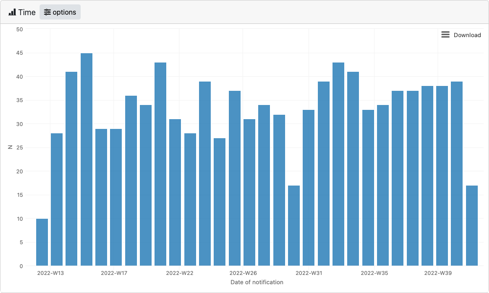
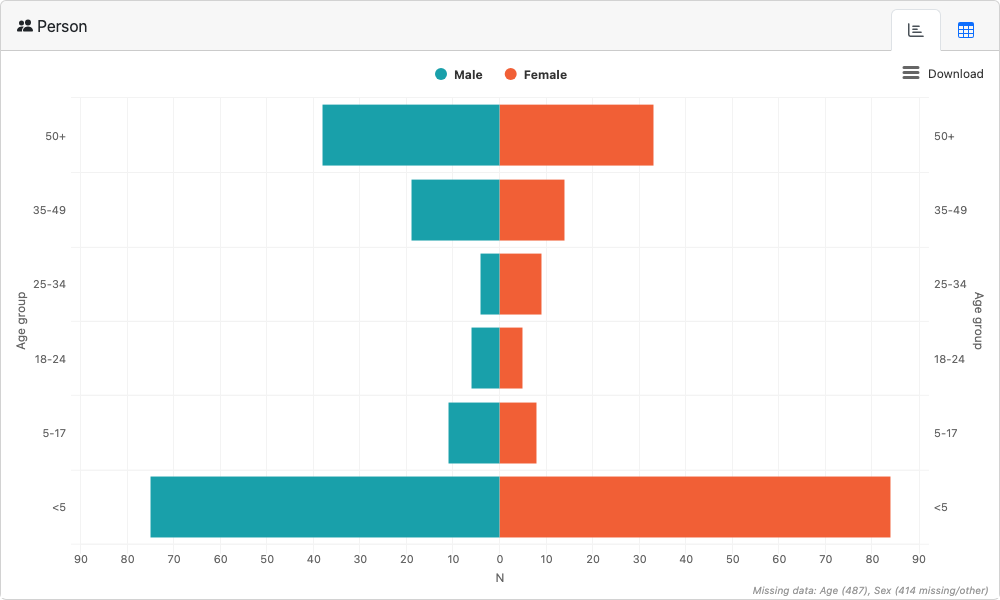

<!-- README.md is generated from README.Rmd. Please edit that file -->

```{r, include = FALSE}
knitr::opts_chunk$set(
  collapse = TRUE,
  comment = "#>",
  fig.path = "man/figures/README-",
  out.width = "100%",
  eval = TRUE,
  warning = FALSE,
  message = FALSE
)
```

# epishiny

<!-- badges: start -->
[](https://lifecycle.r-lib.org/articles/stages.html#experimental)
<!-- badges: end -->

__Please note this package is in alpha stage of development and not yet suitable for use in production as the API is likely to change.__

## Motivation

Interactive web-based data visualisations and dashboards are an increasingly common method 
of monitoring infectious disease outbreaks. Whilst R is now a commonly used tool for analysis 
and data visualisation in epidemiology, epidemiologists will often lack the knowledge required 
to be able to produce interactive dashboards directly from within their R workflows, 
resulting in external propriatory software being used instead.

`epishiny` aims to bridge this gap by providing simple functions that produce engaging, 
feature-rich interactive visualisations and dashboards from epidemiological linelist data 
using R's [`shiny`](https://shiny.posit.co/) web-framework.

## Installation

You can install the development version of epishiny from GitHub with either the [pak](https://pak.r-lib.org/) or [remotes](https://remotes.r-lib.org/) package:

``` r
# install.packages("pak")
pak::pkg_install("epicentre-msf/epishiny")

# install.packages("remotes")
remotes::install_github("epicentre-msf/epishiny")
```

```{r include=FALSE}
library(shinytest2)
pkgload::load_all()
# set to TRUE to take new app screenshots
update_imgs <- FALSE
```

## Demo Dashboard

Launch a demo dashboard with examples of every epishiny module with the `launch_demo_dashboard()` function.
The code for this dashboard can be found in [inst/examples/demo](inst/examples/demo).

```{r include=FALSE}
if (update_imgs) {
  app_path <- here::here("inst/examples/demo")

  app <- AppDriver$new(app_path, width = 1600, height = 900)

  img_path <- tempfile(fileext = ".png")
  app$get_screenshot(file = img_path, delay = 1)
  fs::file_copy(img_path, "man/figures/dashboard.png", overwrite = TRUE)

  app$stop()
}
```

```{r echo=FALSE}
knitr::include_graphics("man/figures/dashboard.png")
```

## Launching individual modules

As well as for use in dashboards, each epishiny module can be launched individually from within an R script allowing for incorporation
into exploratory data analaysis pipelines. Their interactive nature allows the user to quickly visualise the data in different ways,
as well as export images for use in reports and communications with others.  

### Setup

```{r file='inst/examples/docs/setup.R'}
```

### Time module

```{r eval=FALSE}
# launch time epicurve module
launch_module(
  module = "time",
  df = df_ll,
  date_vars = date_vars,
  group_vars = group_vars
)
```

```{r include=FALSE}
if (update_imgs) {
  app_path <- here::here("inst/examples/docs/time")

  app <- AppDriver$new(app_path, width = 1000, height = 600)

  img_path <- tempfile(fileext = ".png")
  app$get_screenshot(file = img_path, delay = 1)
  fs::file_copy(img_path, "man/figures/time.png", overwrite = TRUE)

  app$stop()
}
```

```{r echo=FALSE}

```

### Place module

```{r eval=FALSE}
# launch place map module
launch_module(
  module = "place",
  df = df_ll,
  geo_data = geo_data,
  group_vars = group_vars
)
```

```{r include=FALSE}
if (update_imgs) {
  app_path <- here::here("inst/examples/docs/place")

  app <- AppDriver$new(app_path, width = 1000, height = 600)

  img_path <- tempfile(fileext = ".png")
  app$get_screenshot(file = img_path, delay = 1)
  fs::file_copy(img_path, "man/figures/place.png", overwrite = TRUE)

  app$stop()
}
```

```{r echo=FALSE}
knitr::include_graphics("man/figures/place.png")
```

### Person module

```{r eval=FALSE}
# launch person age/sex pyramid module
launch_module(
  module = "person",
  df = df_ll,
  age_var = "age_years",
  sex_var = "sex_id",
  male_level = "Male",
  female_level = "Female"
)
```

```{r include=FALSE}
if (update_imgs) {
  app_path <- here::here("inst/examples/docs/person")

  app <- AppDriver$new(app_path, width = 1000, height = 600)

  img_path <- tempfile(fileext = ".png")
  app$get_screenshot(file = img_path, delay = 1)
  fs::file_copy(img_path, "man/figures/person.png", overwrite = TRUE)

  app$stop()
}
```

```{r echo=FALSE}

```
