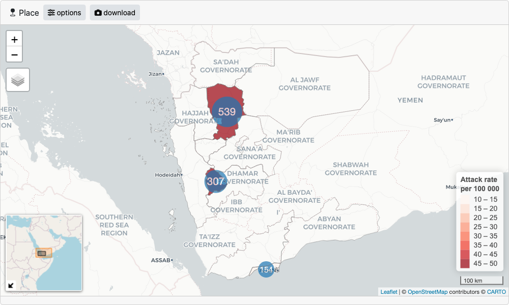

```{r, include = FALSE}
knitr::opts_chunk$set(
  collapse = TRUE,
  comment = "#>",
  out.width = "100%"
)
```

## Setting up data for epishiny

`epishiny` can work with either aggregated or un-aggregated data. Here we will use an 
example of an un-aggregated 'linelist' dataset. A linelist is a (tidy) data format used in 
public health data collection with each row representing an individual (patient, participant, etc) 
and each column representing a variable associated with said individual.

`df_ll` is an example dataset within the package containing data for a fake measles outbreak in Yemen. 
The data contains temporal, demographic, and geographic information for each patient, as well as other medical indicators.

```{r}
suppressPackageStartupMessages(library(dplyr))
suppressPackageStartupMessages(library(epishiny))

glimpse(df_ll)
```

We have geographical patient origin data contained in the `adm` columns, each being an administrative boundary level in Yemen.
If we wan't to visualise this data on a map we need to provide accompanying geo data that we can match to the linelist data.
`sf_yem`, a dataset within the package, is a list containing geo boundary data for adm1 and adm2 levels in Yemen, stored
as [sf](https://r-spatial.github.io/sf/) objects.

```{r}
sf_yem
```

Luckily we can easily match this to the linelist data via the `pcode` columns. In real world scenarios, you might not have
harmonious pcodes available in your data, so if you need help matching messy epi data to geo data, check out our 
[hmatch package](https://epicentre-msf.github.io/hmatch/).

Now let's set up the geo data in the format required for epishiny. We use the `geo_layer` function to define a layer, and
since we have multiple layers in this case, we combine them in a list.

```{r eval=FALSE}
# setup geo data for adm1 and adm2 using the
# geo_layer function to be passed to the place module
# if population variable is provided, attack rates
# will be shown on the map as a choropleth
geo_data <- list(
  geo_layer(
    layer_name = "Governorate", # name of the boundary layer
    sf = sf_yem$adm1, # sf object with boundary polygons
    name_var = "adm1_name", # column with place names
    pop_var = "adm1_pop", # column with population data (optional)
    join_by = c("pcode" = "adm1_pcode") # geo to data join vars: LHS = sf, RHS = data
  ),
  geo_layer(
    layer_name = "District",
    sf = sf_yem$adm2,
    name_var = "adm2_name",
    pop_var = "adm2_pop",
    join_by = c("pcode" = "adm2_pcode")
  )
)
```

## Launching modules

Now we have everything we need to launch the `time`, `place` and `person` modules. 
As well as for use in dashboards, each epishiny module can be launched individually from within an R script.
Below is an example of each module passing the minimum required arguments. See each modules documentation
(`?time_server`, `?place_server`, `?person_server`) for full details of all features and arguments that can be passed.

### Time

```{r eval=FALSE}
launch_module(
  module= "time",
  df = df_ll,
  date_vars = "date_notification"
)
```

```{r echo=FALSE}
knitr::include_graphics("../man/figures/time.png")
```

### Place

```{r eval=FALSE}
# launch place map module
launch_module(
  module = "place",
  df = df_ll,
  geo_data = geo_data
)
```

```{r echo=FALSE}

```

### Person

```{r eval=FALSE}
launch_module(
  module= "person",
  df = df_ll,
  age_group_var = "age_group",
  sex_var = "sex_id",
  male_level = "Male",
  female_level = "Female"
)
```

```{r echo=FALSE}
knitr::include_graphics("../man/figures/person.png")
```

## Dashboards

`epishiny` modules can be included in any shiny dashboard by adding the `module_ui` component to the shiny ui function,
and the `module_server` component to the shiny server function. If you're new to shiny, don't worry, `epishiny` is designed 
so that you can build fully-featured dashboards without worrying about what is happening on the shiny back-end. But if you do want to 
learn more, a good place to start is the [Mastering Shiny](https://mastering-shiny.org/) book, authored by Hadley Wickham.

`epishiny` modules use UI elements from the [bslib](https://rstudio.github.io/bslib/index.html) package, so the only constraint 
is that you use `bslib` for your dashboards user interface. See the [bslib shiny dashboards](https://rstudio.github.io/bslib/articles/dashboards/index.html)
article for full details on designing a UI with `bslib`. 

Below is a full dashboard example incorporating all `epishiny` modules in a `bslib` user interface.

```{r eval=FALSE, file='../inst/examples/docs/app.R'}
```
